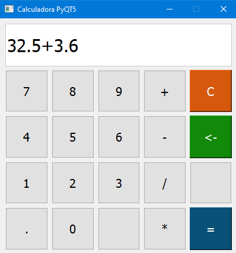
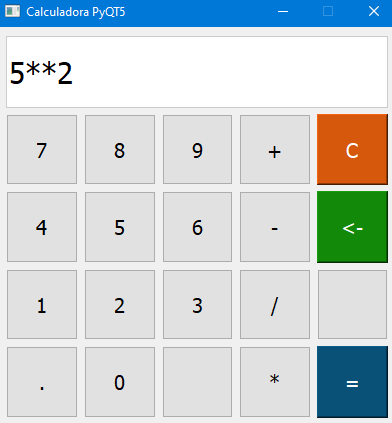

# Calculadora simples com Python e PyQT5.
>Programa que gera um app de calculadora simples com Python e PyQT5

Esse código foi realizado juntamente com o curso de Python da Udemy e tem como objetivo gerar uma calculadora que realiza operações simples (soma,subtração, multiplicação, divisão, potência)




## Exemplo de Uso

Basta digitar a conta deseja e realizar operações matemáticas como em uma calculadora comum.

* Para realizar operação de potência, basta digitar 2 vezes o operador "  *  ", como na imagem abaixo:




## Ambiente de Desenvolvimento

Para a aplicação funcionar corretamente deve-se instalar (além do Python), o Módulo PyQt5 através do comando:

```shell
    pip install pyqt5
```

## Meta

Bruno Augusto --- [Linkedin](https://www.linkedin.com/in/brunoaugp/) --- brunoaugp@hotmail.com

<https://github.com/brunoaugp>


